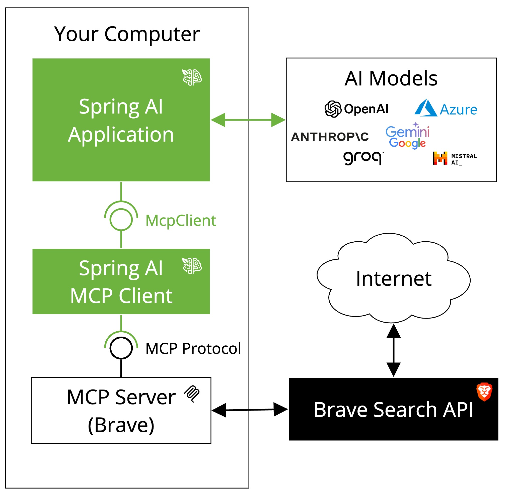

# Spring AI - Model Context Protocol (MCP) Brave Search Example

This example demonstrates how to create a Spring AI Model Context Protocol (MCP) client that communicates with the [Brave Search MCP Server](https://github.com/modelcontextprotocol/servers/tree/main/src/brave-search). The application shows how to build an MCP client that enables natural language interactions with Brave Search, allowing you to perform internet searches through a conversational interface. Instead of using Spring Boot autoconfiguration, this example demonstrates how to manually configure the MCP client transport using an `@Bean` definition.

When run, the application demonstrates the MCP client's capabilities by asking a specific question: "Does Spring AI supports the Model Context Protocol? Please provide some references." The MCP client uses Brave Search to find relevant information and returns a comprehensive answer. After providing the response, the application exits.



## Prerequisites

- Java 17 or higher
- Maven 3.6+
- npx package manager
- Git
- OpenAI API key
- Brave Search API key (Get one at https://brave.com/search/api/)

## Setup

1. Install npx (Node Package eXecute):
   First, make sure to install [npm](https://docs.npmjs.com/downloading-and-installing-node-js-and-npm)
   and then run:
   ```bash
   npm install -g npx
   ```

2. Clone the repository:
   ```bash
   git clone https://github.com/spring-projects/spring-ai-examples.git
   cd model-context-protocol/brave
   ```

3. Set up your API keys:
   ```bash
   export OPENAI_API_KEY='your-openai-api-key-here'
   export BRAVE_API_KEY='your-brave-api-key-here'
   ```

4. Build the application:
   ```bash
   ./mvnw clean install
   ```

## Running the Application

Run the application using Maven:
```bash
./mvnw spring-boot:run
```

The application will execute a single query asking about Spring AI's support for the Model Context Protocol. It uses the Brave Search MCP server to search the internet for relevant information, processes the results through the MCP client, and provides a detailed response before exiting.

## How it Works

The application integrates Spring AI with the Brave Search MCP server through several components:

### MCP Client Setup

```java
@Bean
public McpSyncClient mcpClient() {

   // https://github.com/modelcontextprotocol/servers/tree/main/src/brave-search
   var stdioParams = ServerParameters.builder("npx")
           .args("-y", "@modelcontextprotocol/server-brave-search")
           .addEnvVar("BRAVE_API_KEY", System.getenv("BRAVE_API_KEY"))
           .build();

   var mcpClient = McpClient.sync(new StdioClientTransport(stdioParams)).build();
   var init = mcpClient.initialize();
   logger.info("MCP Initialized: {}", init);
   return mcpClient;
}
```

The MCP client is configured to:
1. Use the Brave Search MCP server via npx
2. Pass the Brave API key from environment variables
3. Initialize a synchronous connection to the server

### Function Callbacks

The application automatically discovers and registers available Brave Search tools:

```java
List<McpFunctionCallback> functionCallbacks = mcpClient.listTools(null)
        .tools()
        .stream()
        .map(tool -> new McpFunctionCallback(mcpClient, tool))
        .toList();
```

These callbacks enable the ChatClient to:
- Access Brave Search tools during conversations
- Handle function calls requested by the AI model
- Execute search queries against the Brave Search API

### Chat Integration

The ChatClient is configured with the Brave Search function callbacks:

```java
var chatClient = chatClientBuilder
        .defaultFunctions(functionCallbacks.toArray(new McpFunctionCallback[0]))
        .build();
```

This setup allows the AI model to:
- Understand when to use Brave Search
- Format queries appropriately
- Process and incorporate search results into responses

## Dependencies

The project uses:
- Spring Boot 3.3.6
- Spring AI 1.0.0-SNAPSHOT
- spring-ai-starter-model-openai
- spring-ai-starter-mcp-client
